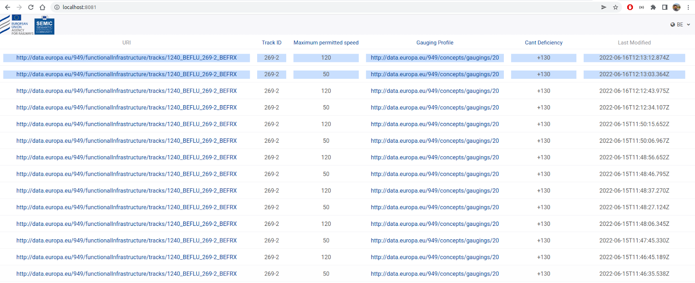

# RINF-alert-service
Demo Web application to visualize infrastructure element changes of RINF's LDES (Linked Data Event Stream). This repository is meant to work together with the LDES publishing module available at: https://github.com/SEMICeu/RINF-LDES.

The alert service demo is implemented as a simple React-based Web application. It presents a tabular view to the user that includes the latest updated data objects (in this case [**era:Track**](https://data-interop.era.europa.eu/era-vocabulary/#Track) segments) and their property values. It also includes a time stamp showing when the data object was updated.

The user can select on the top right the country she/he is interested in and the application will proceed to fetch the latest updates from the selected country’s LDES. This process will be performed periodically by the application every 5 seconds and if any new data objects are found since the last update, these will be displayed to the user highlighted in blue, as seen next:

